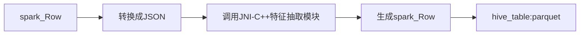
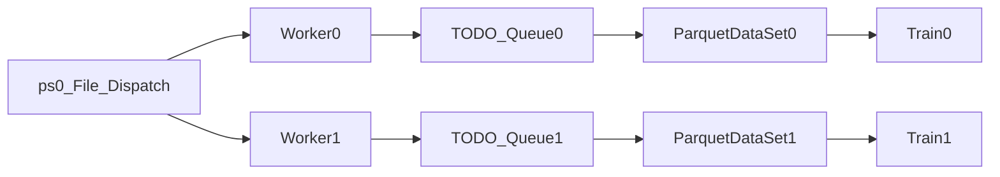

# 1. 背景

推荐场景一般的特征调研过程如下：

(1) 原始特征拼接：主要是将原始特征dump下来的数据  + label （点击、时长、付费等）拼接起来生成一张hive表。

(2) 特征抽取模块：主要是将原始特征以一定规则(DAG图算子化)抽取成离散值或者连续值，其中离散值一般是hash(slot+value)，连续值一般都是一些点击率之类的合法作弊信号。核心是提取正负反馈的信号，提供给模型进行训练。

(3) 抽取后特征存储：抽取后的特征一般存放在hdfs上面，为了方便选取特征，一般会将特征拆开，按照slot维度进行存储，然后在特征选择和解析函数，根据slot的key进行选择那些特征是要的，那些特征是不需要的。常见的存储格式就是：明文格式，tfrecord格式， parquet格式。实际上就是行存和列存的方案，具体对比如下：

| 选型         | 格式样例                    | 格式 | 优点              | 缺点         |
| :--------- | :---------------------- | :- | :-------------- | :--------- |
| 明文格式       | label:1,slot1:1,slot2:2 | 行存 | 直接可读，顺序IO       | 数据量大       |
| tfrecord格式 | map\<slot,feature>      | 行存 | protobuf压缩，顺序IO | 数据量大， 可视化差 |
| parquet格式  | 按列存                     | 列存 | 按列取，压缩率高，可视化    | 随机IO       |

# 2. 特征抽取模块改造

将原来MR任务产出的tfrecord特征存储，切换到spark任务产出parquet特征存储。

得到的具体收益如下: parquet+snappy压缩

tfrecord：1.5T/d

parquet：300G/d

数据存储量节省了80%以上，可以达到很好的降本增效的效果，同时训练可以按列按需读取，可以放到hive上面方便统计特征和增量更新(结合数据湖)。

# 3. 模型训练特征读取优化

模型训练是个流式训练的过程，主要分成三部分耗时：读取特征IO、前向反向计算、拉取sparse和dense参数IO。其中读取特征IO和训练是可以实现overlap的，即进行预加载。如果没有读取特征IO的耗时，理想的训练耗时为：

&#x20;          理想训练耗时时间 = 训练一个step耗时 \* 单机总step数 \* worker数

## 3.1 文件分发模式

分布式异步模型训练的核心思路是数据并行, 数据并行最简单的思路是，一开始扫描所有文件，然后平分给每个worker节点，但是在混部集群存在资源超卖和抢占的情况，部分节点消费数据慢，快节点需要等待慢节点，降低训练速度，从而造成长尾现象。因此需要一个动态数据分发解决慢节点问题。

核心思想如下：

(1) 0号ps实现文件扫描和动态分发

(2) 然后每个worker维护自己的TODO队列，然后起个后台线程，判断队列是否为空，如果为空则prefetch一个新的文件入队列。

(3)  read线程每次顺序pretch一个文件，进行预加载。

(4) 由0号节点维护分发的有效性。

核心代码如下， 这里可以参考：

<https://github.com/intelligent-machine-learning/dlrover/blob/master/dlrover/python/elastic_agent/sharding/client.py>

    class IndexShardingClient(ShardingClient):
        """ShardingClient queries data shards from the DLRover master
        and generates the index of sample from the shard.
        Users can read data from the disk by the sample index.
        Args:
            dataset_name: the name of dataset.
            batch_size: the size of batch data.
            num_epochs: the number of epochs.
            dataset_size: the size of dataset.
            shuffle: whether to shuffle shards.
            task_type: Task type is the computation type like
                elastic_training_pb2.TRAINING, elastic_training_pb2.EVALUATION.
            num_minibatches_per_shard: the number of batch in each shard.
            storage_type: the storage type of dataset. It is "text" if the
                dataset is stored in a text file. It is "table" if the
                dataset is stored in a table like MaxCompute and Hive.
            num_workers: the number of worker processes to share the client
                to get the sample index.
        """

        def __init__(
            self,
            dataset_name,
            batch_size,
            num_epochs,
            dataset_size,
            shuffle=False,
            task_type=elastic_training_pb2.TRAINING,
            num_minibatches_per_shard=_DEFAULT_MINI_BATCH_NUM_PER_SHARD,
            storage_type="",
            num_workers=1,
        ):
            super(IndexShardingClient, self).__init__(
                dataset_name,
                batch_size,
                num_epochs,
                dataset_size,
                shuffle,
                task_type,
                num_minibatches_per_shard,
                storage_type,
            )
            self._num_workers = num_workers
            self._sample_queue = SimpleQueue()
            self._report_sharding_params()

            threading.Thread(
                target=self._prefetch_sample_indices,
                name="fetch_sample_indices",
                daemon=True,
            ).start()

        def _prefetch_sample_indices(self):
            while True:
                if self._sample_queue.empty():
                    task = self.get_task()
                    if not task or not task.shard:
                        for _ in range(128):
                            self._sample_queue.put(None)
                        break
                    ids = (
                        task.shard.indices
                        if task.shard.indices
                        else list(range(task.shard.start, task.shard.end))
                    )
                    for i in ids:
                        self._sample_queue.put(i)
                else:
                    time.sleep(0.001)

        def fetch_sample_index(self):
            """Fetch an index of the sample. The function get an index
            from a queue because there may be multiple sub-process to call
            the function.
            """
            index = self._sample_queue.get()
            if index is None:
                logger.info("No more data.")
                raise StopIteration()
            return index

        def clear_shard_queue(self):
            self._sample_queue = SimpleQueue()

        def restore_shard_from_checkpoint(self, shard_checkpoint):
            # To avoid duplicate shards, drop all shards in the _shard_queue
            # before restoring shard from checkpoint
            # self.clear_shard_queue()
            super().restore_shard_from_checkpoint(shard_checkpoint)

## 3.2 数据读取优化

&#x20;   目前parquet列存读取一般都采用apache arrow的库进行二次封装，开源实现有如：TensorFlow2的tfio，hb的ParquetDataSet。

&#x20;   列存核心优势是利用同一列的数据的相似性，进行压缩，因此在数据的压缩率这块有天然的优势。但是列存也有很大的问题，当列很多会带来随机IO，因此parquet列存，在小batch的cpu训练不会带来很大优势。例如要读取batch size 256的500列的特征数据，意味着大量随机IO之后只读一小批量的数据，当然也可以使用多线程进行读取，提高并发数，但是这种方式很容易将hdfs打挂。

&#x20;   如何解决列存的随机IO的问题呢？远端的hdfs存储为了大批量存储数据，一般都采用普通磁盘，在随机IO这块会比较差。而本地的训练机器性能相对好，标配SSD。因此可以结合上面的代码，在分发文件的过程中，将整个文件块下来到本地SSD盘，这样大批量的数据下载使用的是顺序IO，因此获取文件块的速度是非常快的。然后落盘到本地SSD之后，再进行批量读取性能会飞快。

&#x20;   经过上面的优化，使用parquet列存，训练速度比原来直接读取tfrecord，要稳定快30%以上的训练速度。

# 4. 参考链接

[字节跳动湖平台在批计算和特征场景的实践](https://zhuanlan.zhihu.com/p/627219150)

<https://www.slidestalk.com/b/81>

<https://deeprec.readthedocs.io/zh/latest/WorkQueue.html>

